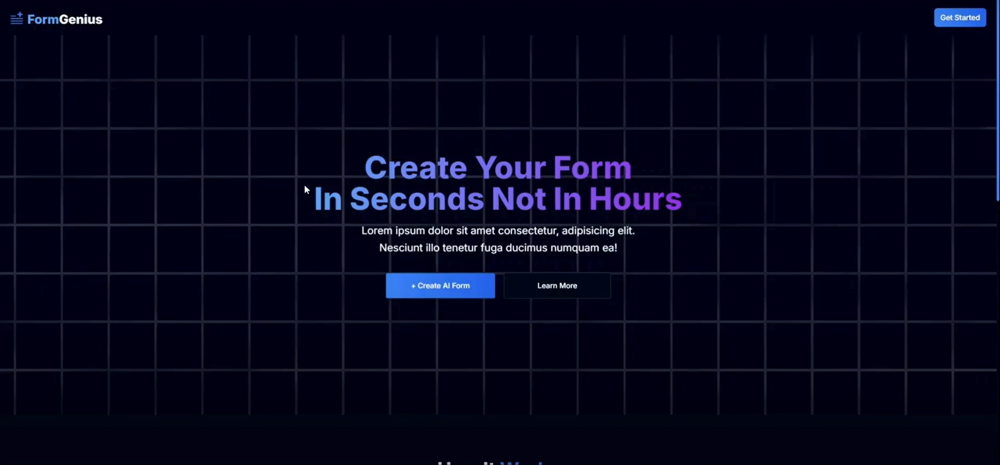
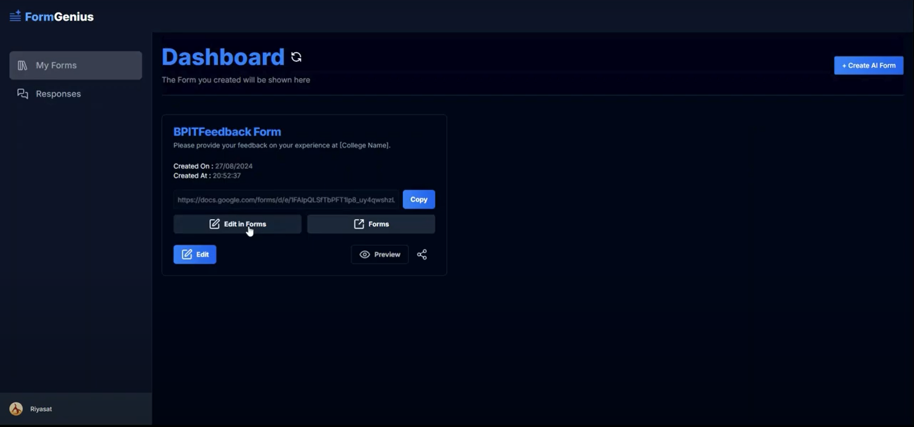
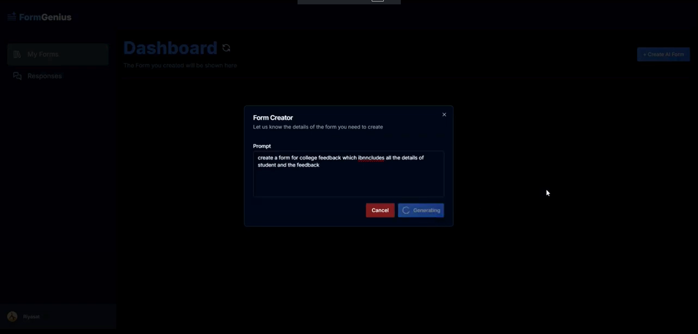
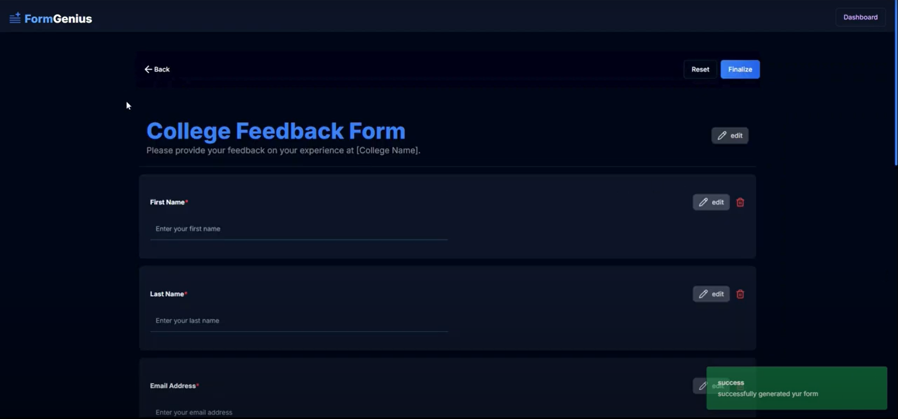

# 🧠 Form Genius

Form Genius is an AI-powered web application that allows users to generate dynamic, customizable forms from natural language prompts. Users can edit, share forms for responses, track submissions in a clean dashboard, and even migrate their form to Google Forms — all in a few clicks.

## 🚀 Features

- ✨ **AI Form Generation**: Create a complete form by simply describing what you need.
- 🛠 **Edit & Customize**: Modify field labels, types, and options in an intuitive editor.
- 📤 **Share & Collect Responses**: Share a public link for users to submit responses.
- 📊 **Submission Dashboard**: View and manage all responses in a clean dashboard.
- 🔁 **Google Forms Integration**: One-click migration to your own Google Forms account.
- 🔒 **Authentication**: Secure login/signup system to manage your forms and data.

## 🖼️ Demo

Link ->  https://www.youtube.com/watch?v=-olODJnQ-H8&t=1s

## 📸 Screenshots

### 1. Home Page

### 2. Dashboard Page

### 3. Prompt Page

### 4. Generated Form Page


## 🧑‍💻 Tech Stack

- **Frontend**: Next.js, TypeScript, Tailwind CSS, ShadCN UI
- **Backend**: Node.js, Express
- **Authentication**: Clerk
- **AI Integration**: Gemini API
- **Database**: PostgreSQL (via Drizzle ORM)
- **Google Integration**: Google OAuth & Google Forms API

## ⚙️ Setup Instructions

1. **Clone the repo**

```bash
git clone https://github.com/yourusername/form-genius.git
cd form-genius
```

2. **Install Dependencies**

```bash
npm install
```

3. **Set up environment variables**
```
NEXT_PUBLIC_CLERK_PUBLISHABLE_KEY 
CLERK_SECRET_KEY

NEXT_PUBLIC_CLERK_SIGN_IN_URL 
NEXT_PUBLIC_CLERK_SIGN_UP_URL

DRIZZLE_DATABASE_URL

NEXT_PUBLIC_GEMINI_API_KEY 
G_DRIVE_FOLDER_ID 
```

4. **Run the server**

```bash
npm run dev
```
